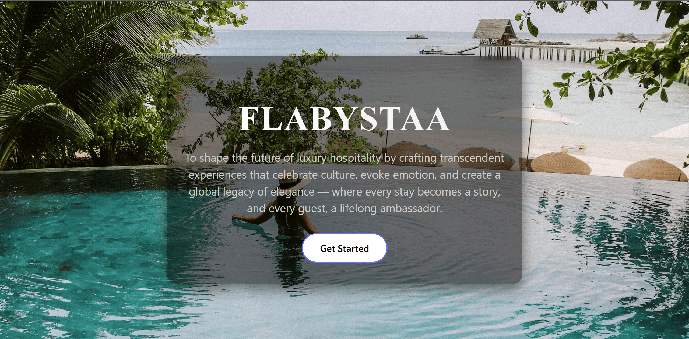
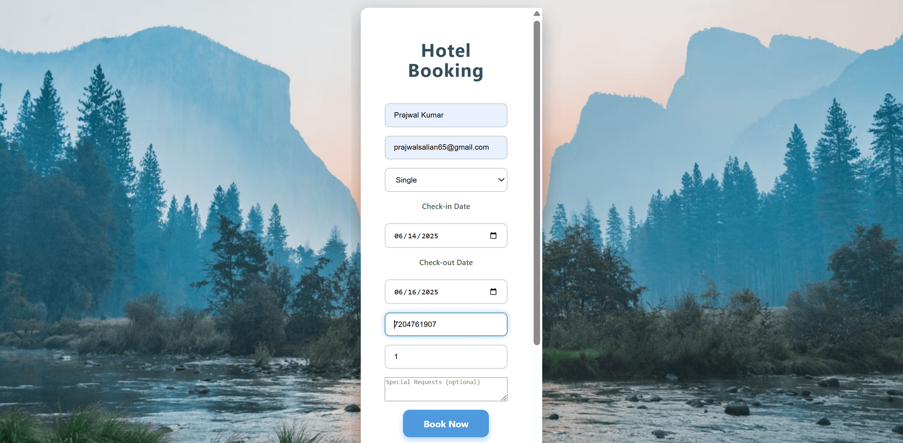
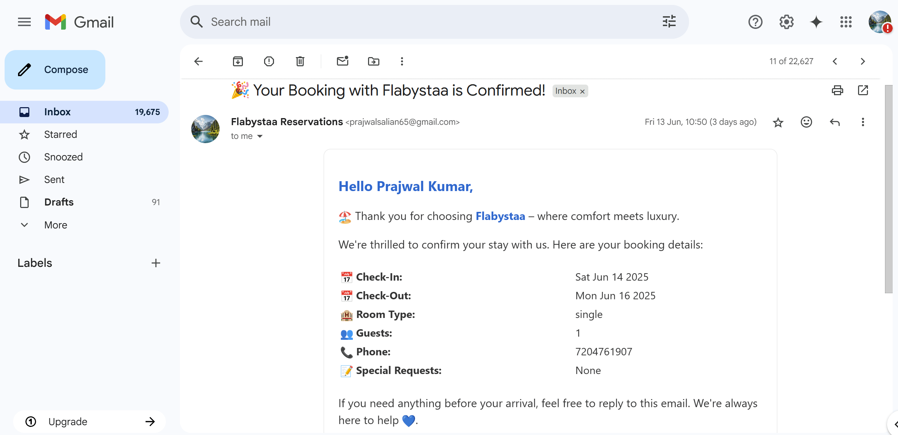

# ✨ Premium Hotel Booking App – MERN Stack

Welcome to the **Premium Hotel Booking App**, a sleek and responsive fullstack web application crafted using the **MERN stack** (MongoDB, Express, React, Node.js). It offers a luxurious booking experience with real-time form validation, personalized email confirmations, and thoughtful UI — built with scalability and user-centric design in mind.

---

## 🧠 Why This Project Stands Out

> 🧩 **Fullstack Excellence** – Built from scratch with clear separation of concerns, RESTful API integration, and clean React architecture.  
> 💌 **Email Automation** – Sends dynamic, personalized booking confirmations using Nodemailer.  
> 🎨 **Polished UI** – Intuitive and mobile-responsive user experience using modern design practices.  
> 📦 **Production Ready** – Easily extensible with cloud DB, auth, and payment gateway integrations.

---

## 📁 Project Structure

---

## 🔥 Core Features

- 🌐 **Landing Page**  
  Showcases premium hotels in a responsive and clean layout.

- 🏨 **Hotel Booking Page**  
  Allows users to select check-in/check-out dates, guest count, and add **special requests** (like late check-in, baby crib, etc.)

- 📧 **Email Confirmation**  
  Users receive a personalized email confirmation with all booking details.

- ✅ **Form Validation**  
  Frontend and backend validation ensures reliable input.

- 📬 **Environment-Safe Config**  
  Secure `.env` for credentials & environment setup.

---

## 📸 Screenshots

### 🖼️ Landing Page

  
  


---

### 🏨 Hotel Booking Page



---

### 📩 Email Confirmation



---

## 🚀 Getting Started

### ✅ Prerequisites

- Node.js & npm
- MongoDB (local or [MongoDB Atlas](https://www.mongodb.com/cloud/atlas))
- Gmail (or SMTP credentials for another service)
- Internet access (for sending emails)

---

## 🛠️ Installation & Setup

### 💻 Frontend (Vite + React)

```bash
cd client
npm install
npm run dev
```

### 🔧 Backend (Node.js + Express)

```bash
cd server
npm install
node server.js

```
